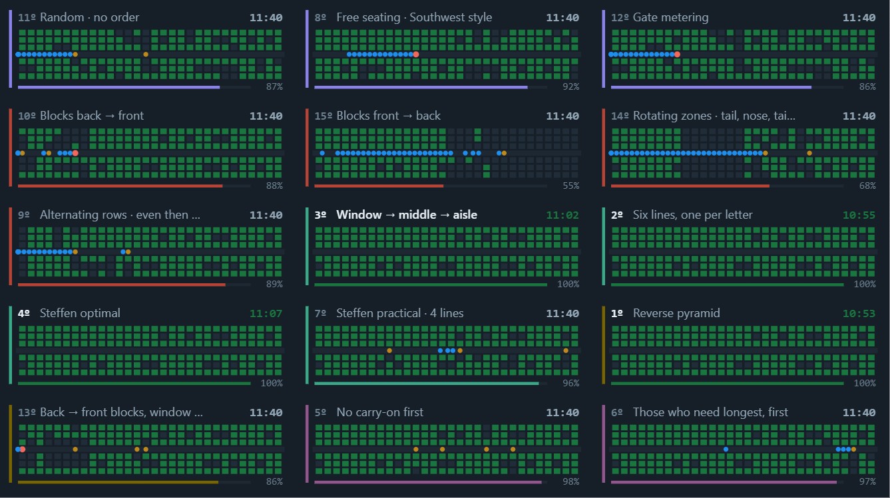
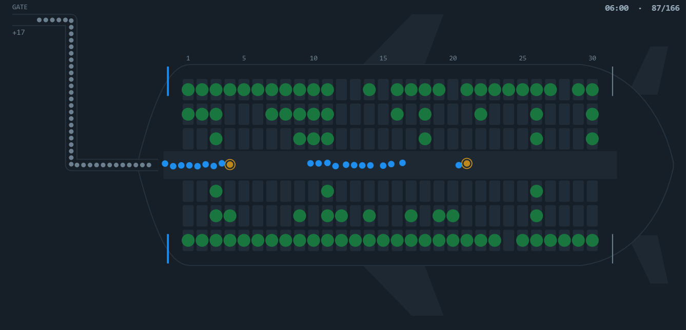

# Boarding Sim

**Fifteen ways to fill an aircraft, racing side by side on the same passengers.**

Boarding an aircraft is a queueing problem with one aisle, no overtaking, and two
ways to stop the line: someone stowing a bag, and someone who has to climb over
the people already sitting between them and the aisle. Everything else — every
boarding method any airline has ever announced over a PA — is an attempt to
schedule those two events so they stop as few people as possible.

This is an agent-based model of that problem, and a harness for running all
fifteen methods **against the identical passenger manifest** so the differences
are attributable to the ordering and not to luck.

**[▶ Live demo](https://mathieutellene.github.io/boarding-sim/)** · one HTML file,
no dependencies, no build step, no CDN.



*Fifteen methods, one manifest, one clock. Live rank in the corner of each panel,
colour by family of method.*

---

## Why boarding is worth modelling

Boarding is the longest task in a narrow-body turnaround, the one with the most
variance, and the only one whose duration is set almost entirely by a queueing
rule the airline chooses for free.

| | |
|---|---|
| **105,674** | commercial flights a day (OAG, 2026 average; peak day 153,359 — Flightradar24, 23 Jul 2026) |
| **€166/min** | cost of delay at the gate (EUROCONTROL standard inputs, 2022 prices; €45/min under 30 min) |
| **~9 pax/min** | boarding rate today, down from ~20 before 1970 (attributed to Boeing, widely cited) |
| **2×** | boarding takes roughly twice as long as in the 1970s — fuller aircraft, more carry-on |

The process got worse while the aircraft stayed the same. An A320 cabin is the
tube it always was; load factors climbed and checked-bag fees pushed luggage into
the overhead bins. Both changes land on the same bottleneck.

**The honest version of the business case.** On the default A320 at 92% load, the
method airlines actually announce — back-to-front blocks — takes **15.6 min**. The
best method here takes **10.8 min**. That 4.7-minute gap costs nothing to capture:
same aircraft, same passengers, same gate staff, different order.

But those minutes are **not** worth 4.7 × €166. Boarding normally sits inside the
scheduled turnaround, so the saving only becomes money when it stops a turn from
overrunning its slot, or when it lets an airline schedule a shorter turn in the
first place. The delay-cost figure is the scale of what an overrun costs, not a
per-flight prize. Anyone quoting the multiplication is selling something.

**Does it reproduce reality?** Run with back-to-front, the model boards at
**10.7 passengers per minute** against the ~9 reported in industry data. Right
magnitude, slightly optimistic — which is what you would expect from a model with
no gate-agent friction, no last-minute bag checks and nobody walking to the wrong
row.

---

## Results

Default A320, 30 rows, 3-3, 92% load (166 passengers), 80% queue compliance.
24 replications per method, common random numbers.

| # | Method | Family | Mean | vs best | Interferences | Aisle wait |
|---|---|---|---|---|---|---|
| 1 | Steffen optimal | by seat letter | **10.8 min** | — | 0 | 113 |
| 2 | Reverse pyramid | hybrid | 10.9 | +0% | 1 | 133 |
| 3 | Six lines, one per letter | by seat letter | 11.2 | +4% | 0 | 122 |
| 4 | Steffen practical · 4 lines | by seat letter | 11.3 | +4% | 11 | 118 |
| 5 | Window → middle → aisle | by seat letter | 11.4 | +5% | 1 | 125 |
| 6 | Alternating rows · even then odd | by row zone | 12.5 | +15% | 46 | 173 |
| 7 | Those who need longest, first | by passenger | 12.6 | +16% | 34 | 152 |
| 8 | **Random · no order** | none | **13.5** | **+24%** | 41 | 154 |
| 9 | Free seating · Southwest style | none | 13.5 | +25% | 58 | 162 |
| 10 | No carry-on first | by passenger | 13.6 | +25% | 42 | 137 |
| 11 | Back → front blocks, window first | hybrid | 13.8 | +27% | 12 | 252 |
| 12 | Gate metering | none | 14.0 | +29% | 41 | **120** |
| 13 | **Blocks back → front** | by row zone | **15.6** | **+43%** | 42 | 286 |
| 14 | Rotating zones · tail, nose, tail… | by row zone | 15.9 | +47% | 42 | 237 |
| 15 | Blocks front → back | by row zone | 20.7 | +91% | 41 | 330 |

Aisle wait is person-minutes spent standing still in the aisle — a comfort
measure, not a time measure.

**The headline is row 8 against row 13.** Sorting passengers into back-to-front
zones is 16% *slower* than sorting nobody at all. Five of the fifteen methods beat
random; four are worse than doing nothing.


---

## Four things the model told me I had wrong

I wrote each method's description from what I expected to happen, then measured it.
Four descriptions had to be rewritten. These are the interesting results, because
they are the ones I would have got wrong by reasoning alone:

**Rotating zones are worse than plain back-to-front** (15.9 vs 15.6 min). Alternating
tail and nose blocks *sounds* better spread. But calling a nose zone early puts
those passengers stowing in front of the entire half-cabin still to come — the
front-to-back pathology applied to half the aircraft.

**Adding "window first" to zone boarding does not save it.** It removes almost all
seat interference (42 → 12 events) and improves back-to-front by 11%, and it is
*still* slower than sorting nobody. Fixing half the problem is not enough: the zone
crowding is untouched. Both faults have to go at once — which is exactly what the
reverse pyramid does, and it reaches second place.

**Boarding slow passengers first is faster, not slower** (12.6 vs 13.5 for random).
I had written it up as expensive courtesy. It pays: the corks form while the aisle
is still half empty, and boarding ends with fast passengers carrying nothing.

**"No carry-on first" does nothing at all** (13.6 vs 13.5). Whatever you gain
clearing the fast half of the cabin early, you hand straight back with every
bin-opener concentrated at the end.

### The subtraction that explains Steffen

Method 6 exists only to isolate a variable. *Alternating rows* spreads passengers
along the tube exactly like Steffen, but avoids not one single seat interference:

```
random               13.5 min
alternating rows     12.5 min   <- spreading along the aisle, no interference fix
Steffen optimal      10.8 min   <- both
```

Spreading explains a little over a third of Steffen's advantage. The other two
thirds is purely nobody having to stand up. That is why window-middle-aisle, which
spreads nothing and only asks people to read their seat letter, lands within 5% of
the theoretical optimum — and why it is the method airlines actually use.

### Compliance is the whole game

The fine-grained orderings assume 166 people line up in an exact sequence. They do
not. Queue compliance is a slider here, and it reorders the entire ranking:

| Queue compliance | Steffen optimal | Window → middle → aisle | Blocks back → front | Random |
|---|---|---|---|---|
| 100% | **7.9 min** | 11.2 | 16.3 | 13.4 |
| 80% *(default)* | 10.7 | 11.3 | 15.5 | 13.4 |
| 60% | 11.1 | 11.6 | 14.3 | 13.4 |
| 40% | 11.3 | 11.7 | 13.3 | 13.5 |
| 0% *(heavy scramble)* | 11.9 | 12.0 | **12.8** | 13.6 |

Three things fall out of that table:

- **Steffen is a paper champion.** Perfect on paper at 7.9 minutes, it gives up
  two-thirds of its lead over window-first by the time compliance is realistic, and
  loses 51% of its own performance across the range.
- **Window-first is almost immune** — 11.2 → 12.0, a 7% spread — because it only
  ever asks for three lines and a seat letter. That robustness, not its peak
  performance, is why it is the method that actually gets used.
- **Back-to-front gets better the less people obey it**, 16.3 → 12.8. Scrambling a
  bad order moves it towards random, and random spreads people along the aisle.
  Somewhere around 40% compliance it stops being worse than sorting nobody.

A method is only worth having if it survives people not following it. That is the
single most useful thing this model has to say, and it is invisible unless you
build compliance in as a parameter.

*(The 0% row is a heavy Gaussian scramble of the intended order, not a true
uniform shuffle — which is why it does not land exactly on the random row.)*

---

## The cabin, in 3D


Drag to orbit, scroll to zoom. Green is seated, blue is walking, amber is stowing,
red is a seat interference in progress. The renderer is a perspective projection
and a painter's-algorithm sort written from scratch on a 2D canvas — about 200
lines, no Three.js, no WebGL, so the project stays a single file with nothing to
install. Framing is recomputed every frame from the projected bounding box of the
fuselage, so it self-frames at any orbit angle and for any aircraft size.

A plan projection of the same state is one click away:



---

## How it works

```
gate queue ──▶ AISLE (single file, no overtaking) ──▶ stow bag ──▶ seat interference ──▶ seated
                      │                                   │                │
                 blocked by the                    blocks everyone   blocks everyone
                 person in front                      behind            behind
```

Each passenger is an agent with a walking speed, a bag count, a seat, and optionally
a travelling group. Per 50 ms step, each agent advances at its own speed until it
hits the minimum spacing behind the person in front; nobody overtakes, so the order
in the aisle is exactly the order they crossed the door.

| Mechanic | What it does |
|---|---|
| **Aisle** | Single lane, minimum spacing 0.46 m. One stopped passenger halts everyone behind |
| **Stowing** | A few seconds per bag with substantial variance; blocks the aisle at that row |
| **Seat interference** | Seated passengers between you and the aisle must get up. Cost grows per person; this is what window-first removes |
| **Groups** | Board and sit together; the stand-up manoeuvre is cheaper among them, but still blocks the aisle |
| **Queue compliance** | Gaussian noise on intended queue position — the gap between a method on paper and a method at a real gate |
| **Free seating** | Seat chosen on entry from a per-passenger zone preference, avoiding seats that need someone to move |
| **Two doors** | Front and aft streams, split at mid-cabin |

**Common random numbers.** All fifteen methods receive the identical manifest — the
same people, bags, walking speeds and seats. Differences are attributable to the
ordering. The statistical comparison repeats this across replications and reports
mean and p10–p90.

---

## Run it

```bash
git clone https://github.com/mathieutellene/boarding-sim
```

Open `index.html`. That is the whole thing — no install, no server, no network.

---

## What is real and what is assumed

Being explicit, because a model that blurs this line is worthless:

| | Status |
|---|---|
| Aisle mechanics, stowing, seat interference, group behaviour, every boarding method's ordering | **Implemented** — these are the model |
| Boarding times, rates, interference counts, all comparisons | **Measured** from the model, not looked up |
| Aircraft geometry (rows, pitch, seat width, aisle width) | **Real** — standard narrow-body dimensions |
| Stow times, walk speeds, interference penalties | **Assumed**, set to the range reported in the boarding literature. They are sliders — move them |
| Load factor, bag mix, group share | **Assumed** defaults, all adjustable |
| Flight counts, delay costs, historical boarding rates | **External sources**, cited below. Nothing in the simulation depends on them |

No real airline's passenger data was used, because none is public. The manifest is
generated.

---

## Limitations

- **Single aisle only.** No 3-4-3 widebody cabins — twin-aisle boarding is a
  different problem, not a bigger one.
- **No crew, carts, wheelchairs or gate-checked bags.** Bags always fit.
- **Nobody makes mistakes.** No one walks to the wrong row, forgets a bag, or
  swaps seats with a stranger. Real boarding has all three and they all cost time.
- **The model is ~19% optimistic** against reported industry boarding rates
  (10.7 vs ~9 pax/min for the same method). Treat differences between methods as
  meaningful and absolute times as a lower bound.
- **Delay cost is context-dependent.** The EUROCONTROL figure is a high-level
  average and its own publication says not to use it for specific operational
  planning. It is here for scale.

---

## Sources

- [EUROCONTROL Standard Inputs for Economic Analyses — cost of delay](https://ansperformance.eu/economics/cba/standard-inputs/latest/chapters/cost_of_delay.html)
- [EUROCONTROL / University of Westminster — European airline delay cost reference values](https://www.eurocontrol.int/publication/european-airline-delay-cost-reference-values)
- [OAG — airline frequency and capacity statistics](https://www.oag.com/airline-frequency-and-capacity-statistics)
- [CNBC — why airlines aren't boarding planes the most efficient way](https://www.cnbc.com/2023/08/31/why-airlines-arent-boarding-planes-the-most-efficient-way-.html)
- Steffen, J. H. (2008), *Optimal boarding method for airline passengers*, Journal of Air Transport Management — the origin of the alternating-row method
- Steffen, J. H. & Hotchkiss, J. (2012), *Experimental test of airplane boarding methods*, Journal of Air Transport Management

---

## Licence

MIT — see [LICENSE](LICENSE).
