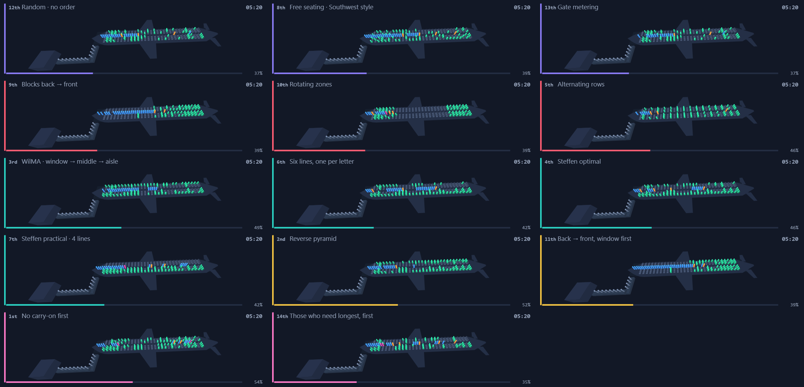
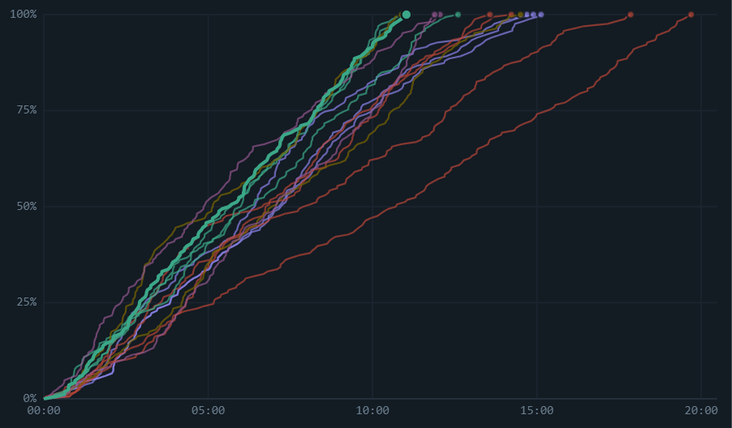
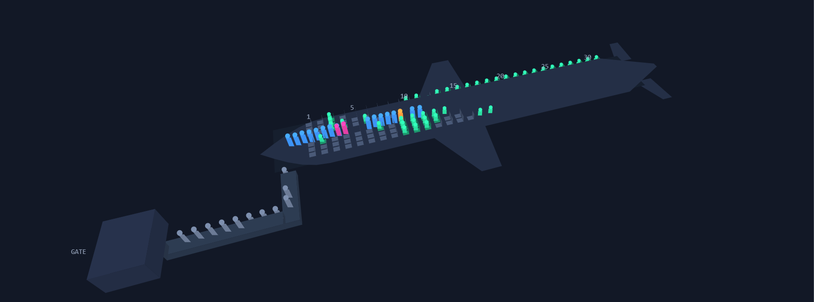
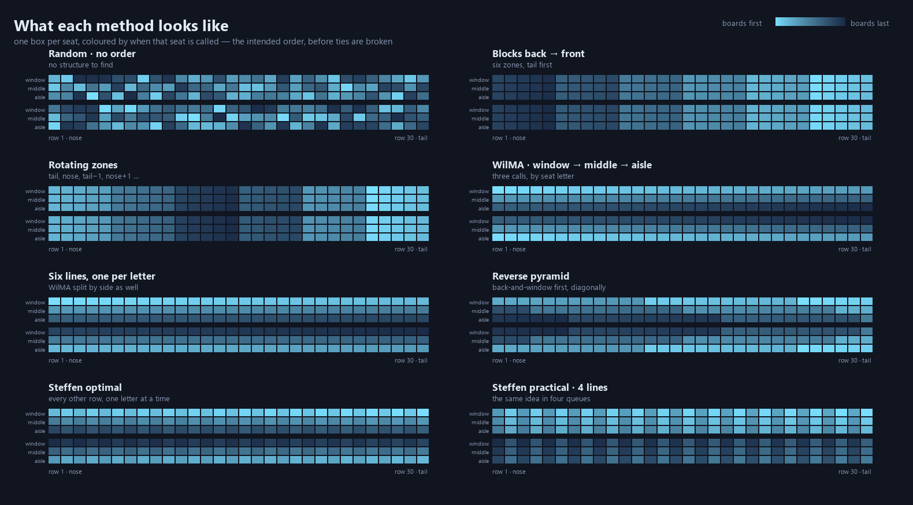

# Boarding Sim

**Fourteen ways to fill an aircraft, racing side by side on the same passengers.**

Boarding is a queueing problem with one aisle, no overtaking, and two ways to stop
the line: someone stowing a bag, and someone climbing over the people already
sitting between them and the aisle. Every boarding method ever announced over a PA
is an attempt to schedule those two events so they block as few people as possible.

This is an agent-based model of that problem, and a harness that runs all fourteen
methods **against the identical passenger manifest** so the differences are
attributable to the ordering and not to luck.

**[▶ Live demo](https://mathieutellene.github.io/boarding-sim/)** · one HTML file,
no dependencies, no build step, no CDN.



*All fourteen, same clock, same 166 passengers. Live rank in each corner, colour by
family of method. Click any cabin to open it on its own.*

---

## Why boarding is worth modelling

Boarding is the longest and most variable task in a narrow-body turnaround, and the
only one whose duration is set almost entirely by a queueing rule the airline
chooses for free.

| | | |
|---|---|---|
| **$100.76** | one minute of block time | US carriers 2024: $35.23 labour, $33.06 fuel, rest maintenance and overhead — Airlines for America |
| **€17.78** | one minute of ground delay in Europe | EUROCONTROL. European delays have cost €17.5 bn since 2015 at 2025 prices |
| **2.2×** | network multiplier | One minute of ground delay in the morning peak becomes 2.2 minutes of arrival delay across the network |
| **150–200 kg/h** | APU fuel burn while boarding | Narrow-body auxiliary power unit, $120–250/h. Widebodies burn 230–300 kg/h |
| **3.15 kg** | CO₂ per kg of jet fuel | Plus 1.237 kg water vapour and 14.8 g NOₓ — EUROCONTROL emission factors |
| **11–13 h** | daily block hours per aircraft | What the best operators extract from a single-aisle jet. Shorter turns are how you get there |

### Two costs, and only one of them is linear

This is the distinction most write-ups of boarding get wrong, so the simulator
reports both separately:

**Fuel and CO₂ convert directly.** The APU runs throughout boarding. Five minutes
saved is five minutes of an auxiliary turbine not burning 150–200 kg/h — every
flight, whether or not the departure time changes. Zurich Airport measured that
ground-side interventions could avoid 5,178 tonnes of fuel a year, 16,360 tonnes of
CO₂. At Copenhagen, APUs and ground support equipment account for 2–9% and 5–9% of
all airport NOₓ respectively.

**Delay cost does not.** Boarding normally sits *inside* the scheduled turnaround,
so minutes saved only become money when they stop a turn overrunning its slot, or
when they let an airline schedule a shorter turn. Multiplying minutes saved by
€/min overstates the case badly. The dollar column in this tool is the *scale of an
overrun*, not a per-flight prize.

### The industry made the problem worse on purpose

Checked-bag fees arrived in 2008 and pushed luggage into the cabin — **$7.3 bn** of
US ancillary revenue in 2024, and a permanent shortage of overhead bin space. That
shortage produced *bin anxiety*, and bin anxiety produced *gate lice*: passengers
crowding the gate before their group is called, a term the Cambridge Dictionary
added in 2025. Cabin crew in most US contracts are **not permitted to lift
passengers' bags**, because of the injury rate. The bottleneck stays.

And then the optimum loses to the business model. Ancillary revenue is a **$55 bn**
market, and priority boarding sells passengers an escape from friction the airline
itself created — while underwriting co-branded credit cards worth billions more.
Calling a scattered group of high-value passengers first destroys any careful
ordering, and airlines accept that deliberately. **Set the priority-boarding slider
above zero and watch the good methods decay.** That is the trade being made.

### It is all moving right now

- **United** reinstated window-middle-aisle in October 2023 and measured **up to two
  minutes per flight**, with an override that keeps one booking together.
- **Southwest** ends **53 years of open seating on 27 January 2026** — killed by
  fuller aircraft (120 seats then, 175 now) and more carry-on.
- **Boeing Space Bins** add 50%+ bin volume: 31,000 gate-checks avoided, 37,000 kg
  of belly capacity recovered and **110 block hours released** per aircraft per year.
- **Biometric gates** clear a passenger in **6–10 seconds**, 60% faster than a manual
  check — but above roughly 25 pax/min the aisle, not the gate, is the constraint.
  That is exactly the kind of claim this model exists to test.

---

## Results

Airbus A320, 30 rows, 3-3, 92% load (166 passengers), 80% queue compliance.
24 replications per method, common random numbers.

| # | Method | Family | Mean | p90 | Spread | pax/min | Interf. | Aisle wait | vs back→front |
|---|---|---|---|---|---|---|---|---|---|
| 1 | Steffen optimal | seat letter | **10.8** | 11.5 | 1.5 | 15.3 | 0 | 113 | +4.7 min |
| 2 | Reverse pyramid | hybrid | 10.9 | 11.8 | 1.9 | 15.3 | 1 | 133 | +4.7 |
| 3 | Six lines, one per letter | seat letter | 11.2 | 11.9 | 1.3 | 14.8 | 0 | 122 | +4.3 |
| 4 | Steffen practical · 4 lines | seat letter | 11.3 | 12.4 | 2.0 | 14.7 | 11 | 118 | +4.2 |
| 5 | **WilMA** · window → middle → aisle | seat letter | 11.4 | 12.4 | 1.9 | 14.6 | 1 | 125 | +4.2 |
| 6 | Alternating rows · even then odd | row zone | 12.5 | 13.6 | 2.0 | 13.3 | 46 | 173 | +3.1 |
| 7 | Those who need longest, first | passenger | 12.6 | 13.4 | 1.9 | 13.2 | 34 | 152 | +3.0 |
| 8 | **Random · no order** | none | **13.5** | 14.7 | 2.4 | 12.3 | 41 | 154 | +2.1 |
| 9 | Free seating · Southwest style | none | 13.5 | 14.8 | 2.7 | 12.3 | 58 | 162 | +2.0 |
| 10 | No carry-on first | passenger | 13.6 | 15.3 | 3.2 | 12.2 | 42 | 137 | +2.0 |
| 11 | Back → front blocks, window first | hybrid | 13.8 | 15.1 | 2.9 | 12.1 | 12 | 252 | +1.8 |
| 12 | Gate metering | none | 14.0 | 15.0 | 2.2 | 11.9 | 41 | **120** | +1.6 |
| 13 | **Blocks back → front** | row zone | **15.6** | 17.2 | 3.0 | 10.7 | 42 | 286 | — |
| 14 | Rotating zones · tail, nose, tail… | row zone | 15.9 | 17.3 | 3.4 | 10.4 | 42 | 237 | −0.4 |

Minutes. *Spread* is p90 − p10: how predictable the method is, which matters to an
operations team as much as the mean. *Aisle wait* is person-minutes spent standing
still in the aisle — a comfort measure, not a time measure.

**The headline is row 8 against row 13.** Sorting passengers into back-to-front
zones is 16% *slower* than sorting nobody at all. Five of the fourteen methods beat
random; three are worse than doing nothing.

The 4.7-minute gap between the best method and the one most airlines announce is
worth **13.7 kg of APU fuel and 43 kg of CO₂ per turn**, which convert directly, and
sits against a $100.76/minute block cost that only converts when the turn overruns.



---

## Four things the model told me I had wrong

I wrote each method's description from what I expected, then measured it. Four had
to be rewritten. These are the interesting results, because they are the ones I
would have got wrong by reasoning alone.

**Rotating zones are worse than plain back-to-front** (15.9 vs 15.6). Alternating
tail and nose blocks *sounds* better spread. But calling a nose zone early puts
those passengers stowing in front of an entire half-cabin that still has to walk
past them — the front-to-back pathology applied to half the aircraft.

**Adding "window first" to zone boarding does not save it.** It removes almost all
seat interference (42 → 12 events) and improves back-to-front by 11%, and it is
*still* slower than sorting nobody. Fixing half the problem is not enough: the zone
crowding is untouched. Both faults have to go at once — which is what the reverse
pyramid does, and it ties for first.

**Boarding the slowest passengers first is faster, not slower** (12.6 vs 13.5). I
had written it up as expensive courtesy. It pays: the jams form while the aisle is
still half empty, and boarding ends with fast passengers carrying nothing.

**"No carry-on first" does nothing at all** (13.6 vs 13.5). Whatever you gain
clearing the fast half of the cabin early, you hand straight back with every
bin-opener concentrated at the end.

### The subtraction that explains Steffen

Method 6 exists only to isolate a variable. *Alternating rows* spreads passengers
along the tube exactly like Steffen, but prevents not one single seat interference:

```
random               13.5 min
alternating rows     12.5 min   <- spreading along the aisle, no interference fix
Steffen optimal      10.8 min   <- both
```

Spreading explains a little over a third of Steffen's advantage. The other two
thirds is purely nobody having to stand up. That is why window-middle-aisle, which
spreads nothing and only asks people to read their seat letter, lands within 5% of
the theoretical optimum — and why it is the method airlines actually use.

### Compliance decides the ranking

The fine-grained orderings assume 166 people line up in an exact sequence. They do
not. Queue compliance is a slider, and it reorders the table:

| Compliance | Steffen | Window→middle→aisle | Back→front | Random |
|---|---|---|---|---|
| 100% | **7.9** | 11.2 | 16.3 | 13.4 |
| 80% *(default)* | 10.7 | 11.3 | 15.5 | 13.4 |
| 60% | 11.1 | 11.6 | 14.3 | 13.4 |
| 40% | 11.3 | 11.7 | 13.3 | 13.5 |
| 0% *(heavy scramble)* | 11.9 | 12.0 | **12.8** | 13.6 |

- **Steffen is a paper champion.** Perfect at 7.9 minutes, it loses 51% of its own
  performance across the range and two-thirds of its lead over window-first.
- **Window-first is almost immune** — 11.2 → 12.0, a 7% spread — because it only
  asks for three lines. That robustness, not its peak, is why it gets used.
- **Back-to-front gets better the less people obey it**, 16.3 → 12.8. Around 40%
  compliance it stops being worse than sorting nobody.

A method is only worth having if it survives people not following it.

---

## The cabin, in 3D



*Back-to-front blocks, mid-boarding: a queue jammed down the forward aisle while only
the tail has anyone in it. That is the entire argument against the method, in one frame.*

Every cabin sits on its aircraft silhouette, with the jet bridge and gate house the
passengers actually walk in from. Grey figures are still on the bridge, blue are
walking the aisle, orange are stowing, pink is a seat interference in progress, green
are seated. Click any of the fourteen to open it on its own — drag to orbit, scroll to
zoom, hover a seat for who is in it and when they sat down.

The renderer is a perspective projection and a painter's-algorithm sort written from
scratch on a 2D canvas: no Three.js, no WebGL, so the project stays a single file with
nothing to install. Rendering fourteen cabins at once needs one trick — all fourteen
share the same geometry, so the scene is projected **once**, cached as a base bitmap
plus a list of projected seat polygons, and re-used at an offset. Each panel then costs
one blit and a few batched fills, which holds fourteen live simulations at 60 fps.

**On the colours.** The stage is dark deliberately: on white, the 3:1 contrast floor
caps saturation and the state colours come out muddy. The four scene colours were
derived with a palette validator rather than picked by eye — worst all-pairs separation
under simulated protanopia and deuteranopia is ΔE 10.8, normal-vision 25.6, all above
3:1 against the stage. The one gate deliberately relaxed is the lightness band, which
exists to give equal-weight chart series a common visual weight and does not apply to
lit objects in a 3D scene.

## What each method looks like



*Eight of the fourteen, drawn as the cabin rather than as a queue. One box per seat,
bright for the first called and dark for the last, with both windows on the outside the
way they sit in a real aircraft. Random is noise. Back-to-front is a gradient from the
tail. WilMA is three clean horizontal bands, because it is defined entirely by the seat
letter. The reverse pyramid is a diagonal. Steffen is the fine alternating stripe —
every other row, one letter at a time — and the four-line version is the same idea
coarsened until a gate agent can actually call it.*

*These show the **intended** order, before ties are broken. Each method sorts people into
groups and leaves the order inside a group to chance, so a picture of the realised queue
buries the structure under that scatter — which is exactly what the previous version of
this figure did.*

Every method card carries a strip of the **real boarding order** for that method on the
current aircraft: one cell per seat, nose on the left, pale for the first passenger
through the door and dark for the last. Back-to-front shows vertical bands; window-first
shows horizontal ones; Steffen shows a fine comb; random shows noise. The strip is
generated from the ordering function itself, so it can never drift away from what the
simulation is doing — and the fuzziness in it is queue compliance eating the pattern.

## Scenarios

Six presets — *Typical*, *Full flight*, *Everyone packs*, *Priority-heavy*, *Perfect
queue*, *Nobody queues* — set the passenger mix, bag mix and compliance in one click.
*Priority-heavy* is the interesting one: push it up and the carefully-ordered methods
collapse towards random, which is the ancillary-revenue trade made visible.
**Tune…** opens every parameter individually, each with a line explaining what it does
and why it matters.

## How it works

```
gate queue ──▶ AISLE (single file, no overtaking) ──▶ stow bag ──▶ seat interference ──▶ seated
                      │                                   │                │
                 blocked by the                    blocks everyone   blocks everyone
                 person in front                      behind            behind
```

| Mechanic | What it does |
|---|---|
| **Aisle** | Single lane, minimum spacing 0.46 m. One stopped passenger halts everyone behind |
| **Stowing** | A few seconds per bag with substantial variance; blocks the aisle at that row |
| **Seat interference** | Seated passengers between you and the aisle must get up. Cost grows per person — this is what window-first removes |
| **Groups** | Board and sit together; the stand-up manoeuvre is cheaper among them, but still blocks the aisle |
| **Queue compliance** | Gaussian noise on intended queue position — the gap between a method on paper and a method at a real gate |
| **Priority boarding** | Whole units pulled to the front regardless of seat — the revenue product that breaks every ordering |
| **Free seating** | Seat chosen on entry from a per-passenger zone preference, avoiding seats that need someone to move |
| **Two doors** | Forward and aft streams, split at mid-cabin |

Six aircraft: A320, A320neo, A321neo, A319, 737-800 and 737 MAX 8 — the most
numerous passenger types in service. All single-aisle, because the model has one
aisle; widebodies are deliberately out of scope.

**Common random numbers.** All fourteen methods receive the identical manifest — the
same people, bags, walking speeds and seats. The replay repeats that across many
manifests and reports mean, p90 and spread.

---

## Reports

**Report (PDF)** builds a print-ready page: full configuration, the headline gap in
minutes / fuel / CO₂ / dollars, the complete results table and the boarding curves,
then opens the print dialogue — save as PDF from there. No library: it is a print
stylesheet. **Download CSV** exports every column plus the configuration as comment
rows, for anyone who wants to do their own analysis.

---

## Run it

```bash
git clone https://github.com/mathieutellene/boarding-sim
```

Open `index.html`. That is the whole thing — no install, no server, no network.

---

## What is real and what is assumed

| | Status |
|---|---|
| Aisle mechanics, stowing, seat interference, groups, every method's ordering | **Implemented** — these are the model |
| Boarding times, rates, interference counts, all comparisons | **Measured** from the model, not looked up |
| Aircraft geometry (rows, pitch, seat width, aisle width) | **Real** — standard narrow-body dimensions |
| Stow times, walk speeds, interference penalties | **Assumed**, set to the range reported in the boarding literature. They are sliders — move them |
| Load factor, bag mix, group share, compliance | **Assumed** defaults, all adjustable |
| Flight counts, delay costs, APU burn, emission factors, ancillary revenue | **External sources**, listed below. Nothing in the simulation depends on them; they only translate minutes into fuel, CO₂ and money |

No real airline's passenger data was used, because none is public. The manifest is
generated.

---

## Limitations

- **Single aisle only.** Twin-aisle boarding is a different problem, not a bigger one.
- **No crew, carts, wheelchairs or gate-checked bags.** Bags always fit — which is
  exactly the assumption the bin-anxiety literature says is wrong, so treat the
  stow-time slider as the place to compensate.
- **Nobody makes mistakes.** No one walks to the wrong row or forgets a bag.
- **The model is ~19% optimistic** against reported industry boarding rates
  (10.7 vs ~9 pax/min for the same method). Treat differences between methods as
  meaningful and absolute times as a lower bound.
- **Delay cost is context-dependent.** EUROCONTROL's own publication says its
  reference values are high-level averages and should not be used for specific
  operational planning. They are here for scale.

---

## Sources

- [EUROCONTROL — Standard Inputs for Economic Analyses, cost of delay](https://ansperformance.eu/economics/cba/standard-inputs/latest/chapters/cost_of_delay.html)
- [EUROCONTROL / University of Westminster — European airline delay cost reference values](https://www.eurocontrol.int/publication/european-airline-delay-cost-reference-values)
- [Airlines for America — cost of aircraft block time](https://www.airlines.org/dataset/per-minute-cost-of-delays-to-u-s-airlines/)
- [OAG — airline frequency and capacity statistics](https://www.oag.com/airline-frequency-and-capacity-statistics)
- [CNBC — why airlines aren't boarding planes the most efficient way](https://www.cnbc.com/2023/08/31/why-airlines-arent-boarding-planes-the-most-efficient-way-.html)
- Steffen, J. H. (2008), *Optimal boarding method for airline passengers*, Journal of Air Transport Management
- Steffen, J. H. & Hotchkiss, J. (2012), *Experimental test of airplane boarding methods*, Journal of Air Transport Management
- Bachmat, E. et al., on the theoretical limits of boarding policies

---

## Licence

MIT — see [LICENSE](LICENSE).
